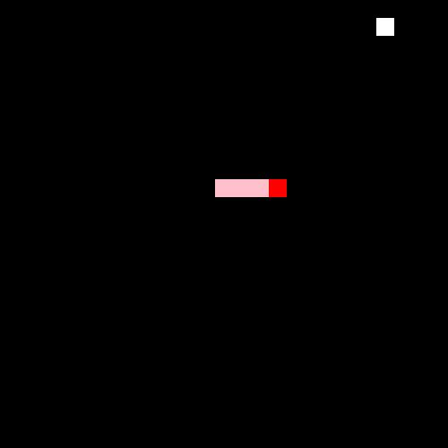

## 贪吃蛇



### 基本功能概述

1. 按上下左右键移动

2. 随机位置产生食物

3. 检测碰撞

### 其他说明

1. 你可以使用我封装好的 jq 框架，也可以运用原来的 jq 框架。

2. 运用 es6 语法规则，主要运用面向对象的思想。

### 代码说明

> 代码拆分了 食物类、地图类、蛇类、游戏类 ，一共四个模块，每一个模块完成自己指定的功能，最终由游戏类汇总。

- jq.js 是 v3.5.1 的版本

* mjq.js 是我自己封装的 简易 jq

* js 文件夹中，存放 food.js（食物类）、map.js（地图类）、snake.js（蛇类）、game.js（游戏类）

### 运行说明

> demo.htm 文件以服务器打开

```js
// 你完全也可以将（原来的 jq 框架）
<script src="./jq.js"></script>
// 换成（自己封装的 jq 框架）
<script src="./mjq.js"></script>
```
